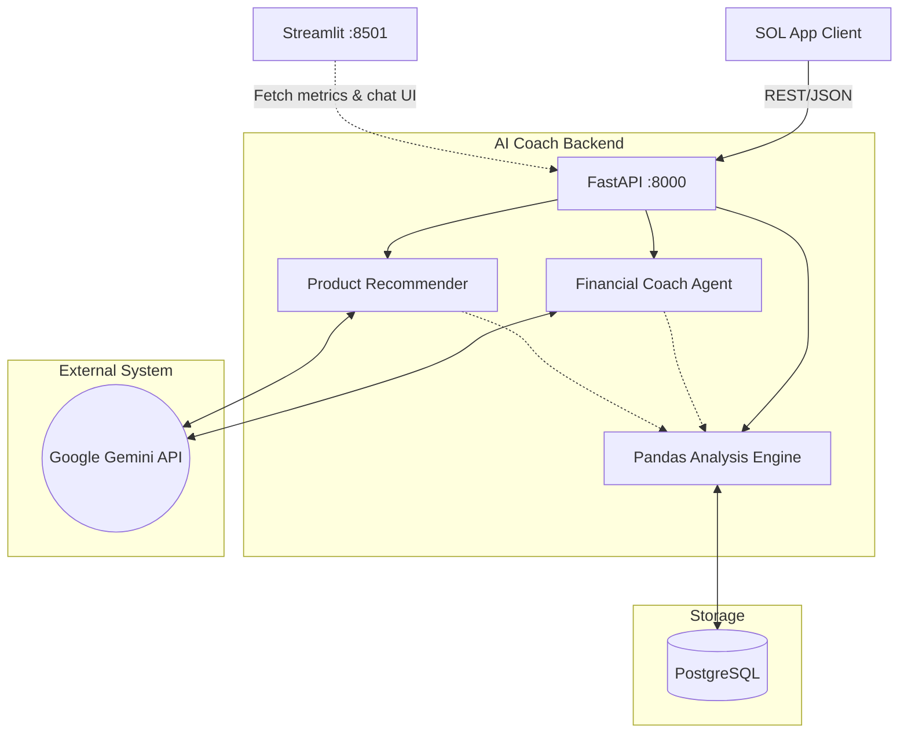

# AI Personal Financial Coach

> **An intelligent financial assistant embedded in the SOL banking app** — analyses spending & income patterns, proactively recommends bank products, and answers personal finance questions using Google Gemini LLM.

---

## Table of Contents

- [Motivation](#motivation)
- [Key Features](#key-features)
- [System Architecture](#system-architecture)
- [Technology Stack](#technology-stack)
- [Project Structure](#project-structure)
- [Getting Started](#getting-started)
- [API Reference](#api-reference)
- [Dashboard](#dashboard)
- [Deployment](#deployment)
- [Research & Methodology](#research--methodology)
- [Roadmap](#roadmap)
- [Contributing](#contributing)
- [License](#license)

---

## Motivation

Traditional banking apps present raw transaction lists without context. Customers must manually categorise spending, track budgets, and research financial products. This project builds an **AI-powered layer** that:

1. **Automatically analyses** spending & income patterns using statistical methods.
2. **Generates personalised insights** (e.g., anomaly detection, savings rate tracking).
3. **Proactively recommends** suitable bank products based on the customer's real financial profile.
4. **Answers financial literacy questions** via a conversational AI coach.

The goal is to increase customer engagement, drive product cross-sell, and improve financial wellbeing — all within the existing SOL mobile/web experience.

---

## Key Features

| Feature | Description |
|---|---|
| **Spending Analytics** | Pandas-powered aggregation with category breakdown, savings rate, and z-score anomaly detection |
| **AI Chat Coach** | Conversational Q&A powered by Google Gemini with spending context injection |
| **Product Recommender** | LLM-based product matching with confidence scores and priority levels |
| **Financial Goals** | CRUD goal tracker with progress monitoring |
| **Interactive Dashboard** | Streamlit + Plotly web UI with real-time charts, chat interface, and recommendation cards |
| **REST API** | FastAPI backend with automatic OpenAPI/Swagger documentation |
| **Docker Ready** | Single-command deployment via Docker Compose |

---

## System Architecture

> Full architecture diagram → `docs/ARCHITECTURE.md`

---

## Technology Stack

| Layer | Technology | Purpose |
|---|---|---|
| **LLM** | Google Gemini 3.1 Flash Lite | Chat, recommendations, insight generation |
| **Backend** | FastAPI + Uvicorn | Async REST API with auto-docs |
| **Analytics** | Pandas + NumPy + scikit-learn | Spending aggregation, anomaly detection |
| **Dashboard** | Streamlit + Plotly | Interactive web visualisation |
| **Database** | SQLAlchemy + SQLite (dev) / PostgreSQL (prod) | Transaction & goal storage |
| **Validation** | Pydantic v2 | Request/response schemas |
| **Logging** | Loguru | Structured application logs |
| **Deployment** | Docker + Docker Compose | Containerised multi-service setup |

---

## Project Structure

`
AI_Personal_Financial_Coach/
├── src/
│   ├── main.py                  # FastAPI application entry point
│   ├── api/                     # API routers (controllers)
│   │   ├── chat.py              # POST /api/v1/chat
│   │   ├── spending.py          # GET  /api/v1/spending/{user_id}
│   │   ├── recommendations.py   # GET  /api/v1/recommendations/{user_id}
│   │   └── goals.py             # CRUD /api/v1/goals
│   ├── agents/                  # LLM integration layer
│   │   ├── financial_coach.py   # Gemini-powered Q&A agent
│   │   └── product_recommender.py
│   ├── services/                # Business logic & analytics
│   │   └── data_analysis.py     # Pandas analytics engine
│   ├── models/                  # Pydantic schemas
│   │   └── schemas.py
│   ├── db/                      # Database layer
│   │   ├── database.py          # SQLAlchemy async engine
│   │   └── models.py            # ORM models
│   ├── prompts/                 # LLM prompt templates
│   │   └── templates.py
│   ├── core/                    # Configuration
│   │   └── config.py
│   └── utils/                   # Logging, helpers
│       └── logging.py
├── dashboard/
│   └── app.py                   # Streamlit dashboard
├── tests/
│   ├── test_api.py              # API endpoint tests
│   └── test_analysis.py         # Analytics unit tests
├── scripts/
│   └── seed_db.py               # Database seeder
├── docs/
│   └── ARCHITECTURE.md          # Detailed architecture doc
├── data/                        # SQLite DB & sample data
├── Dockerfile
├── docker-compose.yml
├── requirements.txt
├── .env.example
├── .gitignore
└── README.md
`

---

## Getting Started

### Prerequisites

- Python 3.11+
- Google Gemini API key ([Get one here](https://aistudio.google.com/apikey))

### 1. Clone & Setup

`ash
git clone https://github.com/tuanthescientist/AI_Personal_Financial_Coach.git
cd AI_Personal_Financial_Coach

python -m venv venv
# Windows
venv\Scripts\activate
# macOS/Linux
source venv/bin/activate

pip install -r requirements.txt
`

### 2. Configure Environment

`ash
cp .env.example .env
# Edit .env and add your GEMINI_API_KEY
`

### 3. Seed Demo Data

`ash
python scripts/seed_db.py
`

### 4. Start the API Server

`ash
uvicorn src.main:app --reload --port 8000
`

API docs available at: `http://localhost:8000/docs`

### 5. Launch the Dashboard

`ash
streamlit run dashboard/app.py
`

Dashboard available at: `http://localhost:8501`

---

## API Reference

| Method | Endpoint | Description |
|---|---|---|
| `GET` | `/health` | Health check |
| `POST` | `/api/v1/chat/` | Chat with AI coach |
| `GET` | `/api/v1/spending/{user_id}?days=30` | Spending analysis |
| `GET` | `/api/v1/recommendations/{user_id}` | Product recommendations |
| `POST` | `/api/v1/goals/` | Create a financial goal |
| `GET` | `/api/v1/goals/{user_id}` | List user goals |

> Interactive Swagger UI → `http://localhost:8000/docs`

---

## Dashboard

The Streamlit dashboard provides three tabs:

1. **Spending Overview** — KPI metrics, pie/bar charts, savings gauge, insights & anomaly alerts
2. **AI Coach Chat** — Conversational interface with full message history
3. **Recommendations** — AI-generated product cards with confidence scores

---

## Deployment

### Docker Compose (recommended)

`ash
docker-compose up --build
`

This starts both services:
- **API**: `http://localhost:8000`
- **Dashboard**: `http://localhost:8501`

### Production Checklist

- [ ] Replace SQLite with PostgreSQL (update `DATABASE_URL`)
- [ ] Set `APP_ENV=production` and `DEBUG=false`
- [ ] Add authentication middleware (OAuth2 / JWT)
- [ ] Configure CORS for specific SOL app domains
- [ ] Set up rate limiting on LLM endpoints
- [ ] Add Redis caching for spending analysis
- [ ] Deploy behind Nginx reverse proxy with HTTPS

---

## Research & Methodology

### Spending Analysis Pipeline

1. **Data Ingestion**: Transaction records are loaded into Pandas DataFrames.
2. **Feature Engineering**: Daily/weekly/monthly aggregation, category ratios, income-to-expense ratios.
3. **Anomaly Detection**: Z-score method flags daily spending > 2σ from the mean.
4. **Insight Generation**: Rule-based triggers combined with LLM-generated natural-language commentary.

### LLM Integration Strategy

- **Prompt Engineering**: System prompt constrains the model to act as a financial coach (no stock tips, grounded in data).
- **Context Injection**: Each chat request includes the user's real spending summary so the LLM can give personalised advice.
- **Structured Output**: Product recommendations use JSON-mode prompting for reliable downstream parsing.
- **Streaming**: Gemini streaming API provides real-time token delivery for better UX.

### Product Recommendation Engine

1. Extract user financial profile (savings rate, top categories, risk tolerance).
2. Format structured prompt with profile data.
3. Gemini returns ranked JSON array of suitable products.
4. Backend validates and scores recommendations before returning to client.

---

## Roadmap

- [x] Core API with spending analysis
- [x] Google Gemini integration for chat & recommendations
- [x] Streamlit dashboard with Plotly visualisations
- [x] Docker deployment
- [ ] Real database integration (PostgreSQL)
- [ ] User authentication (JWT/OAuth2)
- [ ] Budget planner with ML forecasting
- [ ] Multi-language support (Vietnamese / English)
- [ ] Push notification triggers for spending anomalies
- [ ] A/B testing framework for recommendation strategies
- [ ] RAG pipeline with bank product knowledge base

---

## Contributing

1. Fork the repository
2. Create a feature branch (`git checkout -b feature/amazing-feature`)
3. Commit your changes (`git commit -m 'Add amazing feature'`)
4. Push to the branch (`git push origin feature/amazing-feature`)
5. Open a Pull Request

---

## License

This project is for research and educational purposes. See the repository for license details.

